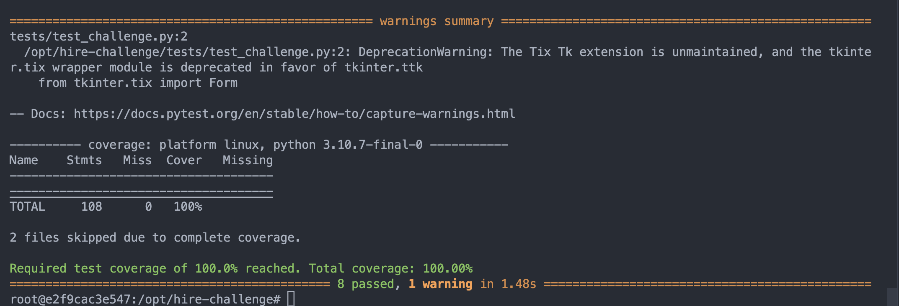

# python-scheduler 
Josie Newman
Simple console based test scheduler. 
- 8 test cases written with 100% test coverage 

Still TODO: 
- Add set up/tear down for tests  
- Add encapsulation with getters and setters esp for Hourly Task class 
- Add more negative tests 
